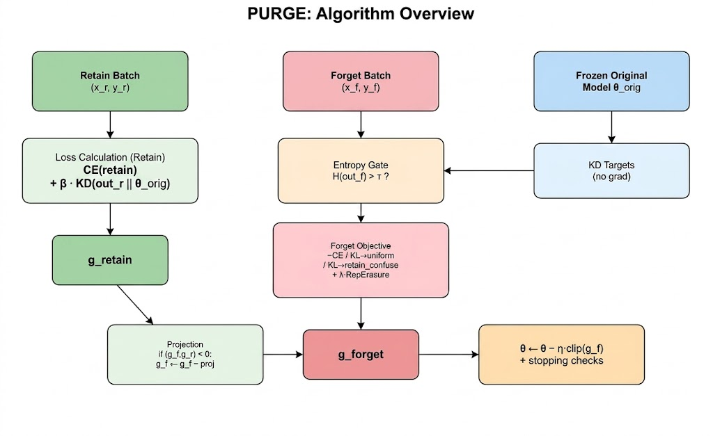
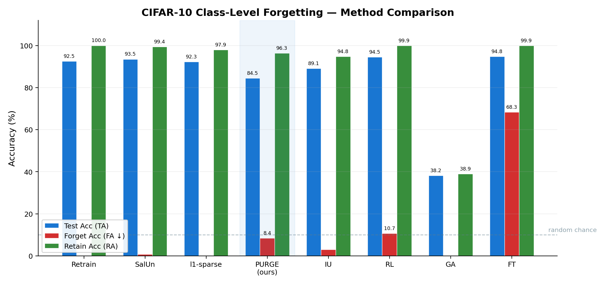
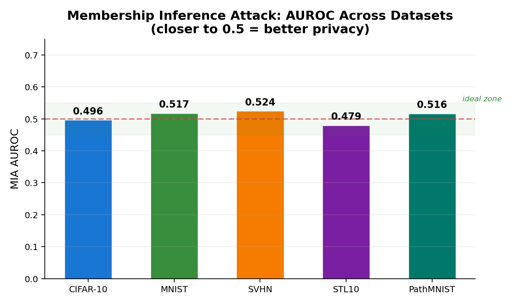
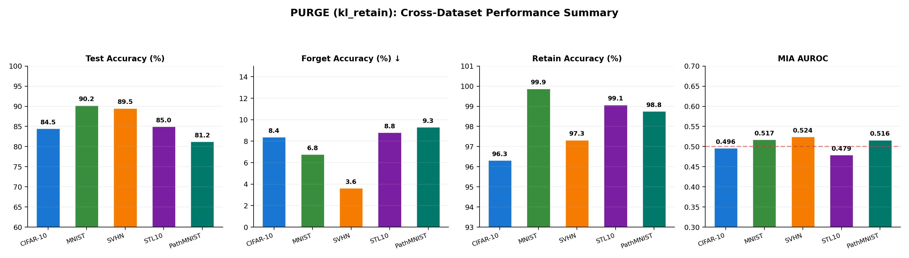
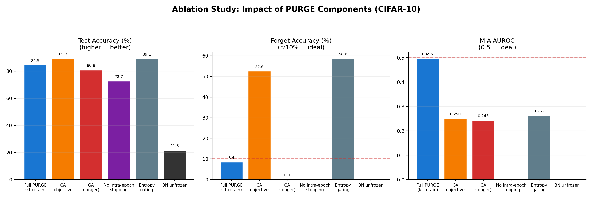

# PURGE — Projected Unlearning via Retain-Guided Erasure

## Overview

This is the main codebase for PURGE. The core functionality is centralized in `src/run.py`.

The code handles base model training, all three unlearning objectives (GA, kl_uniform,
kl_retain), evaluation (accuracy + MIA AUROC + feature distance), and the gradient
projection mechanism. See the main project report for algorithmic details.



## Environment Setup

### Hardware Used
- GPU: NVIDIA A100 / RTX 3090 (or equivalent CUDA-capable GPU)
- RAM: 16 GB minimum
- CUDA: 11.8+

### Dependencies

```bash
# Create conda environment (recommended)
conda create -n purge python=3.10 -y
conda activate purge

# Install from requirements.txt
pip install -r requirements.txt
```

Or use the requirements file directly:
```bash
pip install -r requirements.txt
```

### Dependency Versions
- Python 3.10+
- PyTorch >= 2.0.0
- torchvision >= 0.15.0
- numpy >= 1.24.0
- tqdm >= 4.65.0
- scikit-learn >= 1.2.0
- medmnist >= 2.2.0 (for PathMNIST experiments)

## Project Structure

```
03_code/
├── README.md              # This file
├── requirements.txt       # Python dependencies
├── src/
│   └── run.py             # Main PURGE implementation
├── scripts/
│   ├── train_base.sh      # Train base model from scratch
│   ├── unlearn_cifar10.sh # Run unlearning on CIFAR-10
│   ├── unlearn_mnist.sh   # Run unlearning on MNIST
│   ├── unlearn_pathmnist.sh # Run unlearning on PathMNIST
│   ├── unlearn_stl10.sh      # Run unlearning on STL-10
│   ├── unlearn_svhn.sh    # Run unlearning on SVHN
│   ├── eval.sh            # Evaluate an unlearned model
│   └── demo.sh            # Full demo: base training + unlearning
└── configs/
    ├── cifar10_kl_retain.yaml   # Recommended CIFAR-10 config
    ├── cifar10_ga.yaml          # CIFAR-10 gradient ascent baseline
    ├── pathmnist_kl_retain.yaml # PathMNIST config
    ├── mnist_kl_retain.yaml     # MNIST config
    ├── stl10_kl_retain.yaml     # STL-10 config
    └── svhn_kl_retain.yaml      # SVHN config
```

## Training Commands

### 1. Train a base model (run once)

```bash
python src/run.py \
    --dataset cifar10 --model resnet18 \
    --forget_type class --forget_class 0 \
    --data_dir ./data --save_dir ./checkpoints \
    --epochs 0
```

Setting `--epochs 0` trains the base model only (no unlearning). This downloads
the dataset the first time, so make sure you have internet access.

### 2. Run unlearning (CIFAR-10, recommended kl_retain)

```bash
python src/run.py \
    --dataset cifar10 --model resnet18 \
    --forget_type class --forget_class 0 \
    --checkpoint ./checkpoints/base_cifar10_resnet18.pth \
    --data_dir ./data --save_dir ./checkpoints \
    --epochs 15 --lr 5e-4 \
    --rep_weight 0.05 --kd_weight 2.0 \
    --max_grad_norm 1.0 \
    --forget_objective kl_retain \
    --forget_gate 0 \
    --retain_budget_factor 5.0
```



Or, using a YAML config (much shorter):
```bash
python src/run.py --config configs/cifar10_kl_retain.yaml --forget_class 0
```
CLI arguments always override config values, so you can still tweak individual params:
```bash
python src/run.py --config configs/cifar10_kl_retain.yaml --forget_class 3 --epochs 20
```

### 3. Run unlearning (PathMNIST)

```bash
python src/run.py \
    --dataset pathmnist --model resnet18 \
    --forget_type class --forget_class 0 \
    --checkpoint ./checkpoints/base_pathmnist_resnet18.pth \
    --data_dir ./data --save_dir ./checkpoints \
    --epochs 15 --lr 5e-4 \
    --rep_weight 0.05 --kd_weight 2.0 \
    --max_grad_norm 1.0 \
    --forget_objective kl_retain \
    --forget_gate 0 \
    --retain_budget_factor 5.0
```

### 4. Run unlearning (MNIST)

```bash
python src/run.py \
    --dataset mnist --model resnet18 \
    --forget_type class --forget_class 0 \
    --checkpoint ./checkpoints/base_mnist_resnet18.pth \
    --data_dir ./data --save_dir ./checkpoints \
    --epochs 12 --lr 2e-4 \
    --rep_weight 0.03 --kd_weight 3.0 \
    --max_grad_norm 1.0 \
    --forget_objective kl_retain \
    --forget_gate 0 \
    --retain_budget_factor 4.0 \
    --fa_target 10.0
```

### 5. Run unlearning (SVHN)

```bash
python src/run.py \
    --dataset svhn --model resnet18 \
    --forget_type class --forget_class 0 \
    --checkpoint ./checkpoints/base_svhn_resnet18.pth \
    --data_dir ./data --save_dir ./checkpoints \
    --epochs 12 --lr 2e-4 \
    --rep_weight 0.03 --kd_weight 3.0 \
    --max_grad_norm 1.0 \
    --forget_objective kl_retain \
    --forget_gate 0 \
    --retain_budget_factor 4.0
```

### 6. Run unlearning (STL-10)

```bash
python src/run.py \
    --dataset stl10 --model resnet18 \
    --forget_type class --forget_class 0 \
    --checkpoint ./checkpoints/base_stl10_resnet18.pth \
    --data_dir ./data --save_dir ./checkpoints \
    --epochs 12 --lr 2e-4 \
    --rep_weight 0.03 --kd_weight 3.0 \
    --max_grad_norm 1.0 \
    --forget_objective kl_retain \
    --forget_gate 0 \
    --retain_budget_factor 4.0
```

### 7. Gradient ascent baseline

```bash
python src/run.py \
    --dataset cifar10 --model resnet18 \
    --forget_type class --forget_class 3 \
    --checkpoint ./checkpoints/base_cifar10_resnet18.pth \
    --epochs 10 --lr 5e-4 \
    --forget_objective ga
```

## Evaluation Commands

Evaluation runs automatically at the end of each unlearning run, but you can also
re-evaluate a saved checkpoint without re-running unlearning:

```bash
# re-evaluate a previously saved checkpoint (no unlearning, just metrics)
bash scripts/eval.sh ./checkpoints/purge_cifar10_resnet18_class_c0_ep15_lr0.0005.pth cifar10 0
```

Or manually:
```bash
python src/run.py \
    --dataset cifar10 --model resnet18 \
    --forget_type class --forget_class 0 \
    --checkpoint ./checkpoints/purge_cifar10_resnet18_class_c0_ep15_lr0.0005.pth \
    --data_dir ./data --save_dir ./checkpoints \
    --epochs 0
```

The evaluation prints:
- Test Accuracy (TA), Forget Accuracy (FA), Retain Accuracy (RA)
- Unlearning Accuracy (UA = 100 - FA)
- MIA AUROC (forget-class train vs forget-class test)
- Feature-level metrics (cosine similarity, L2 distance)
- Projection rate and gate rate diagnostics





## Empirical Observations & Implementation Notes

- **BatchNorm must be in eval mode** during unlearning. If you leave it in training mode, the running stats get corrupted because forget batches are all one class. We lost an afternoon to this — accuracy dropped to ~21% before we figured it out.
- **PathMNIST downloads can be slow**: The medmnist servers sometimes throttle; if the download hangs, try again or cache the data manually.
- **rep_weight needs to stay low (0.03–0.05)**: Going above 0.1 makes things unstable because the retain-mean target is recomputed per batch rather than globally. We tried 0.1 early on and got erratic loss curves.
- **kd_weight matters a lot**: Too low and retain accuracy drifts; too high and the model can't forget. We found 2.0–5.0 works across our datasets, but it took some trial and error.
- **Seed is fixed at 42** for reproducibility. We'd ideally run multiple seeds but didn't have enough compute time.



## Demo Commands

A consolidated demonstration script is provided:
```bash
bash scripts/demo.sh
```

Alternatively, to manually invoke the demo pipeline:
```bash
# Quick demo: train base + unlearn class 0 on CIFAR-10
python src/run.py \
    --dataset cifar10 --model resnet18 \
    --forget_type class --forget_class 0 \
    --epochs 0

python src/run.py \
    --dataset cifar10 --model resnet18 \
    --forget_type class --forget_class 0 \
    --checkpoint ./checkpoints/base_cifar10_resnet18.pth \
    --epochs 15 --lr 5e-4 \
    --forget_objective kl_retain \
    --rep_weight 0.05 --kd_weight 2.0 \
    --retain_budget_factor 5.0
```

## Key Hyperparameters

These are the argparse **defaults** (fallback values). For actual recommended settings, use the YAML configs in `configs/` or the shell scripts in `scripts/` — the reported results all use `kl_retain` with tuned values, not these defaults.

| Flag | Default | Description |
|---|---|---|
| `--lr` | 5e-4 | SGD learning rate |
| `--epochs` | 10 | Upper bound on unlearning epochs |
| `--rep_weight` (λ) | 0.1 | Weight for multi-layer representation erasure |
| `--kd_weight` (β) | 1.0 | Weight for KD-anchored retain regularisation |
| `--temperature` | 4.0 | Distillation temperature |
| `--max_grad_norm` | 5.0 | Gradient clipping threshold |
| `--forget_objective` | `ga` | `ga`, `kl_uniform`, or `kl_retain` |
| `--forget_gate` | 0.9 | Entropy-based forget gate factor (0 = disable) |
| `--retain_budget_factor` | 5.0 | Stop when retain loss > initial × factor |
| `--fa_target` | None | Stop when FA ≤ target % (default: random chance) |
| `--config` | None | Path to YAML config file (CLI args override config) |
