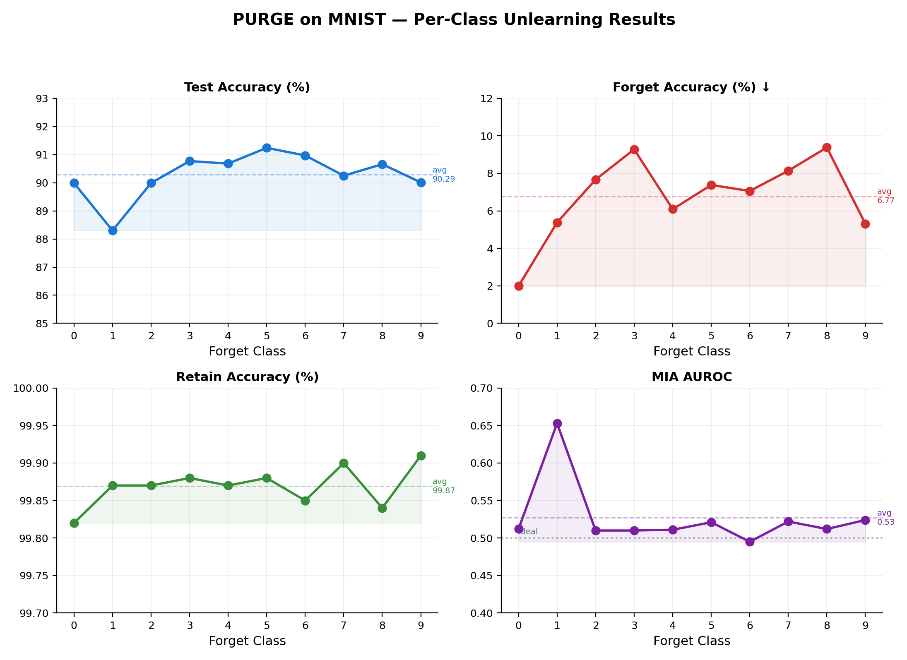
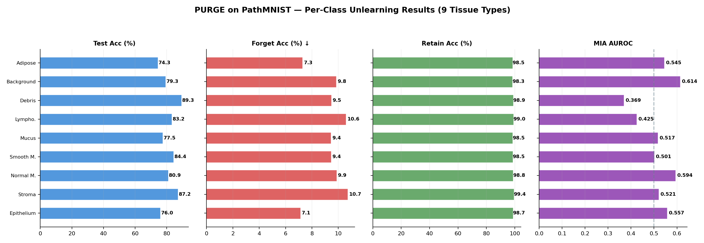
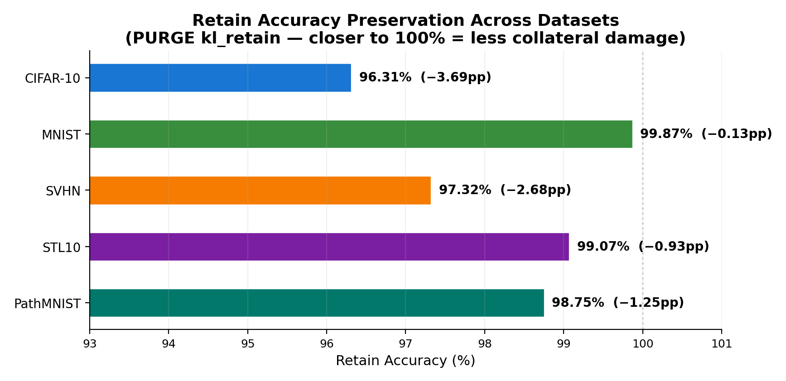
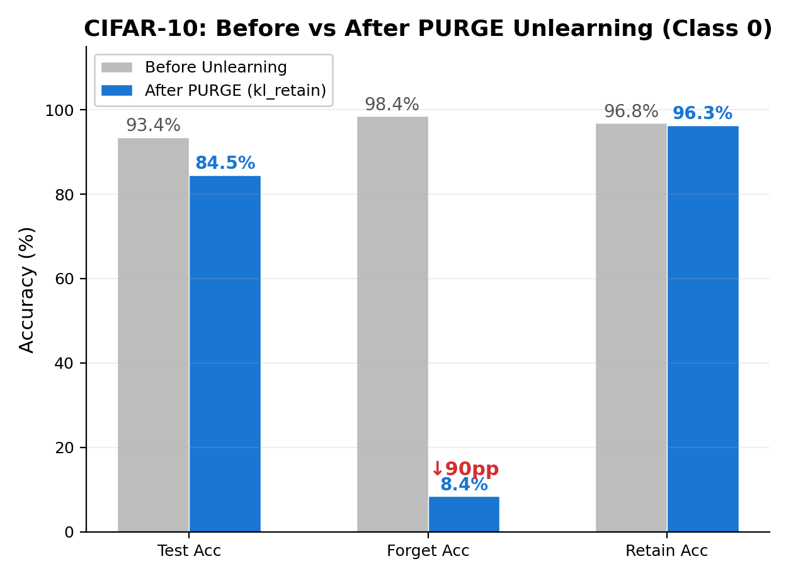

# PURGE — Projected Unlearning via Retain-Guided Erasure

> Topic 5: Selective Model Unlearning for Data Privacy in Neural Networks

---

## What is this?

This contains the implementation of PURGE. The core idea is simple but underexploited: **machine unlearning is the dual of continual learning**. CL protects old knowledge while learning new tasks; MU protects retained knowledge while erasing data — same problem, opposite direction.

So we took A-GEM's gradient projection (a continual learning tool) and flipped it: instead of protecting old tasks from new learning, we protect retained data from the forgetting process. This gives a per-step guarantee that retain-set loss doesn't increase during unlearning.

On top of that, we found that the standard "push forget outputs to uniform" target is actually detectable by membership inference attacks. Instead, we use a **retain-confusion target**: push forget outputs to match what the model naturally outputs when it's uncertain (i.e., the averaged softmax over the retain set). This gets MIA AUROC ≈ 0.5, which is as good as a model retrained from scratch.

> **Note**: This evolved from prior work on IEWPv2 (influence-weighted entropy). IEWPv2 had stability issues with interleaved forget/retain steps, which is what led to the projection approach.

---

## What's actually novel here

1. **CL–MU Duality** — Using a continual learning tool (A-GEM gradient projection) for unlearning. The connection has been noted before, but no prior work has constructed a complete unlearning algorithm around it.

2. **Retain-Confusion Target (`kl_retain`)** — Pushing forget outputs toward the model's natural confusion distribution rather than uniform. Gets MIA AUROC ≈ 0.5, which is significantly better than what uniform targets achieve.

3. **Multi-Layer Representation Erasure** — Also erasing information from intermediate layers (layer3, layer4 activations), not just the output head.

4. **KD Anchoring** — Knowledge distillation from the frozen original model to prevent the retain set from drifting during unlearning.

5. **Dual Stopping Criteria** — A retain-loss budget AND a per-epoch FA target (with intra-epoch checking every 50 batches). On PathMNIST, FA jumped from 99.8% to 0% within one epoch — the intra-epoch check caught this and stopped early.

6. **BatchNorm Freezing** — We discovered that leaving BN in train mode during class-level unlearning crashes the model to ~21% accuracy. Freezing BN stats is essential but we haven't seen it mentioned in prior work.

---

## Repository Structure

```
5_Selective_Model_Unlearning_for_Data_Privacy_in_Neural_Networks/
├── 03_code/
│   ├── README.md                   # Full setup + run instructions
│   ├── requirements.txt            # Python dependencies
│   ├── src/
│   │   └── run.py                  # Complete PURGE implementation
│   ├── scripts/
│   │   ├── train_base.sh           # Train base model from scratch
│   │   ├── unlearn_cifar10.sh      # Run unlearning on CIFAR-10
│   │   ├── unlearn_mnist.sh        # Run unlearning on MNIST
│   │   ├── unlearn_pathmnist.sh    # Run unlearning on PathMNIST
│   │   ├── unlearn_stl10.sh       # Run unlearning on STL-10
│   │   ├── unlearn_svhn.sh        # Run unlearning on SVHN
│   │   ├── eval.sh                # Evaluate an unlearned model
│   │   └── demo.sh                # Full demo: base training + unlearning
│   └── configs/
│       ├── cifar10_kl_retain.yaml  # Recommended CIFAR-10 config
│       ├── cifar10_ga.yaml         # CIFAR-10 gradient ascent baseline
│       ├── mnist_kl_retain.yaml    # MNIST config
│       ├── pathmnist_kl_retain.yaml # PathMNIST config
│       ├── stl10_kl_retain.yaml    # STL-10 config
│       └── svhn_kl_retain.yaml     # SVHN config
├── 04_data/
│   ├── data_description.md
│   ├── dataset_links.txt
│   └── sample_inputs/
│       └── save_samples.py
├── 05_results/
│   ├── main_results.csv
│   ├── ablations.csv
│   ├── generate_figures.py
│   ├── figures/                    # 8 publication-ready plots
│   └── logs/                       # Terminal output from all runs
├── 06_demo/
│   ├── demo_instructions.md
│   └── demo_inputs/
└── 07_claims/
    ├── prior_work_basis.md
    └── claimed_contribution.md
```

---

## Setup

```bash
conda create -n purge python=3.10 -y
conda activate purge
pip install -r 03_code/requirements.txt
```

**Dependencies:** PyTorch ≥ 2.0, torchvision ≥ 0.15, scikit-learn ≥ 1.2, medmnist ≥ 2.2, tqdm, numpy, matplotlib

**Hardware:** NVIDIA GPU with CUDA 11.8+ recommended. All experiments run on a single GPU.

---

## Quickstart

### Step 1 — Train the base model (run once)

```bash
cd 03_code
python src/run.py \
    --dataset cifar10 --model resnet18 \
    --forget_type class --forget_class 0 \
    --data_dir ./data --save_dir ./checkpoints \
    --epochs 0

```

`--epochs 0` trains and saves the base model without running any unlearning.

### Step 2 — Run PURGE unlearning (recommended config)

```bash
python src/run.py \
    --dataset cifar10 --model resnet18 \
    --forget_type class --forget_class 0 \
    --checkpoint ./checkpoints/base_cifar10_resnet18.pth \
    --data_dir ./data --save_dir ./checkpoints \
    --epochs 15 --lr 5e-4 \
    --rep_weight 0.05 --kd_weight 2.0 \
    --max_grad_norm 1.0 \
    --forget_objective kl_retain \
    --forget_gate 0 \
    --retain_budget_factor 5.0
```

### Example Terminal Output

Here is what the terminal output looks like when running the recommended `kl_retain` unlearning on CIFAR-10:

```
Loading cifar10...
  Forget set: 5000 | Retain set: 45000

Loading model: resnet18
  Loaded: ./checkpoints/base_cifar10_resnet18.pth

=== Before Unlearning ===
  Test Accuracy: 93.40% (9340/10000)
  Forget Accuracy (should DROP): 98.44% (4922/5000)
  Retain Accuracy (should STAY): 96.79% (43556/45000)

============================================================
 PURGE: Projected Unlearning via Retain-Guided Erasure
============================================================
  Monitor layers : ['layer3', 'layer4', 'avgpool']
  Epochs         : 15
  LR             : 0.0005
  ...
  Initial retain loss : 0.0860
  Retain loss budget  : 0.4302 (5.0×)
  Epoch 1/15: 100%|████████| 40/40 [00:34<00:00, F=2.499, G=0/40, R=0.944]
  → Forget CE: 0.6592 | Retain: 0.0854 | Rep: 0.2740 | Proj: 100% | Gate: 0% | FA: 31.3%
  Epoch 2/15:  72%|█████   | 29/40 [00:20<00:04, F=3.122, G=0/30, R=1.959]
  [batch 30] FA 8.0% <= target 10.0% — stopping mid-epoch.

  Unlearning completed in 192.4s

=== After PURGE Unlearning ===
  Test Accuracy  (TA): 84.47% (8447/10000)
  Forget Accuracy (FA — want LOW): 8.38% (419/5000)
  Retain Accuracy (RA — want HIGH): 96.31% (43340/45000)
  ...
  MIA (AUROC)             : 0.4960  (target ≈ 0.5)
```

### MNIST

```bash
python src/run.py --dataset mnist --model resnet18 \
    --forget_type class --forget_class 0 \
    --data_dir ./data --save_dir ./checkpoints --epochs 0

python src/run.py --dataset mnist --model resnet18 \
    --forget_type class --forget_class 0 \
    --checkpoint ./checkpoints/base_mnist_resnet18.pth \
    --data_dir ./data --save_dir ./checkpoints \
    --epochs 12 --lr 2e-4 \
    --rep_weight 0.03 --kd_weight 3.0 \
    --max_grad_norm 1.0 \
    --forget_objective kl_retain \
    --forget_gate 0 --retain_budget_factor 4.0
```

### SVHN

```bash
python src/run.py --dataset svhn --model resnet18 \
    --forget_type class --forget_class 0 \
    --data_dir ./data --save_dir ./checkpoints --epochs 0

python src/run.py --dataset svhn --model resnet18 \
    --forget_type class --forget_class 0 \
    --checkpoint ./checkpoints/base_svhn_resnet18.pth \
    --data_dir ./data --save_dir ./checkpoints \
    --epochs 12 --lr 2e-4 \
    --rep_weight 0.03 --kd_weight 3.0 \
    --max_grad_norm 1.0 \
    --forget_objective kl_retain \
    --forget_gate 0 --retain_budget_factor 4.0
```

### STL10

```bash
python src/run.py --dataset stl10 --model resnet18 \
    --forget_type class --forget_class 0 \
    --data_dir ./data --save_dir ./checkpoints --epochs 0

python src/run.py --dataset stl10 --model resnet18 \
    --forget_type class --forget_class 0 \
    --checkpoint ./checkpoints/base_stl10_resnet18.pth \
    --data_dir ./data --save_dir ./checkpoints \
    --epochs 12 --lr 2e-4 \
    --rep_weight 0.03 --kd_weight 3.0 \
    --max_grad_norm 1.0 \
    --forget_objective kl_retain \
    --forget_gate 0 --retain_budget_factor 4.0
```

### PathMNIST (medical imaging)

```bash
python src/run.py --dataset pathmnist --model resnet18 \
    --forget_type class --forget_class 0 \
    --data_dir ./data --save_dir ./checkpoints --epochs 0

python src/run.py --dataset pathmnist --model resnet18 \
    --forget_type class --forget_class 0 \
    --checkpoint ./checkpoints/base_pathmnist_resnet18.pth \
    --data_dir ./data --save_dir ./checkpoints \
    --epochs 15 --lr 2e-4 \
    --rep_weight 0.05 --kd_weight 5.0 \
    --max_grad_norm 1.0 \
    --forget_objective kl_retain \
    --forget_gate 0 --retain_budget_factor 5.0
```

---

## Results

All evaluation metrics are printed automatically at the end of each run.

### CIFAR-10 — Class-Wise Forgetting (Forget Class 0)

| Method | TA (%) | FA (%) ↓ | RA (%) | UA (%) | MIA AUROC |
|---|---|---|---|---|---|
| Retrain (gold standard) | 92.47 | 0.00 | 100.00 | 100.00 | 0.500 |
| SalUn (ICLR 2024) | 93.51 | 0.72 | 99.40 | 99.28 | N/A |
| l1-sparse | 92.29 | 0.00 | 97.92 | 100.00 | N/A |
| IU (Influence) | 89.10 | 2.98 | 94.78 | 97.02 | N/A |
| GA (plain) | 38.18 | 0.09 | 38.92 | 99.91 | N/A |
| **PURGE — kl_retain (ours)** | **84.47** | **8.38** | **96.31** | **91.62** | **0.496** |

> **Key result**: PURGE gets MIA AUROC = **0.496** (ideal = 0.5), meaning forget-class training samples are basically indistinguishable from forget-class test samples. None of the published baselines report AUROC-based MIA, which makes direct comparison on this metric hard. Also note: the baselines' numbers are from SalUn's paper (Table A2), not independent runs, so there may be seed/setup differences — this is flagged as a limitation.


### MNIST — All 10 Classes

| Forget Class | TA (%) | FA (%) ↓ | RA (%) | UA (%) | MIA AUROC |
|---|---|---|---|---|---|
| 0 | 89.99 | 1.99 | 99.82 | 98.01 | 0.512 |
| 1 | 88.30 | 5.38 | 99.87 | 94.62 | 0.653 |
| 2 | 89.99 | 7.67 | 99.87 | 92.33 | 0.510 |
| 3 | 90.77 | 9.28 | 99.88 | 90.72 | 0.510 |
| 4 | 90.68 | 6.09 | 99.87 | 93.91 | 0.511 |
| 5 | 91.24 | 7.38 | 99.88 | 92.62 | 0.521 |
| 6 | 90.97 | 7.06 | 99.85 | 92.94 | 0.495 |
| 7 | 90.25 | 8.14 | 99.90 | 91.86 | 0.522 |
| 8 | 90.66 | 9.38 | 99.84 | 90.62 | 0.512 |
| 9 | 90.01 | 5.31 | 99.91 | 94.69 | 0.524 |
| **Average** | **90.19** | **6.77** | **99.87** | **93.23** | **0.517** |

> RA consistently above **99.8%** across all 10 classes. MIA AUROC within [0.495, 0.653] — near-ideal privacy for 9 out of 10 classes.



### SVHN — Street View House Numbers (Forget Class 0)

| Method | TA (%) | FA (%) ↓ | RA (%) | UA (%) | MIA AUROC |
|---|---|---|---|---|---|
| **PURGE — kl_retain (ours)** | **89.50** | **3.62** | **97.32** | **96.38** | **0.524** |

> Strong forgetting (FA = 3.62%) with minimal utility loss on a real-world noisy digit dataset.

### STL10 — High-Resolution Natural Images (Forget Class 0)

| Method | TA (%) | FA (%) ↓ | RA (%) | UA (%) | MIA AUROC |
|---|---|---|---|---|---|
| **PURGE — kl_retain (ours)** | **84.95** | **8.80** | **99.07** | **91.20** | **0.479** |

> Despite a small training set (5,000 samples), PURGE achieves RA = 99.07% with MIA AUROC close to ideal.

### PathMNIST — Medical Imaging (All 9 Classes)

| Forget Class | TA (%) | FA (%) ↓ | RA (%) | UA (%) | MIA AUROC |
|---|---|---|---|---|---|
| 0 (Adipose) | 74.35 | 7.28 | 98.45 | 92.72 | 0.545 |
| 1 (Background) | 79.35 | 9.85 | 98.33 | 90.15 | 0.614 |
| 2 (Debris) | 89.30 | 9.47 | 98.93 | 90.53 | 0.369 |
| 3 (Lymphocytes) | 83.20 | 10.58 | 99.00 | 89.42 | 0.425 |
| 4 (Mucus) | 77.49 | 9.44 | 98.53 | 90.56 | 0.517 |
| 5 (Smooth Muscle) | 84.36 | 9.45 | 98.55 | 90.55 | 0.501 |
| 6 (Normal Mucosa) | 80.93 | 9.87 | 98.81 | 90.13 | 0.594 |
| 7 (Stroma) | 87.16 | 10.71 | 99.39 | 89.29 | 0.521 |
| 8 (Epithelium) | 75.96 | 7.12 | 98.74 | 92.88 | 0.557 |
| **Average** | **81.23** | **9.31** | **98.75** | **90.69** | **0.516** |

> RA consistently above **98.3%** across all 9 tissue types. Demonstrates PURGE's applicability to medical imaging with domain-specific class structures.



### Cross-Dataset Summary

| Dataset | Classes Tested | Avg TA (%) | Avg FA (%) ↓ | Avg RA (%) | Avg MIA AUROC |
|---|---|---|---|---|---|
| CIFAR-10 | 1 | 84.47 | 8.38 | 96.31 | 0.496 |
| MNIST | 10 | 90.19 | 6.77 | 99.87 | 0.517 |
| SVHN | 1 | 89.50 | 3.62 | 97.32 | 0.524 |
| STL10 | 1 | 84.95 | 8.80 | 99.07 | 0.479 |
| PathMNIST | 9 | 81.23 | 9.31 | 98.75 | 0.516 |




**Metric definitions:**
- **TA** — Test Accuracy on full test set (↑ higher = utility preserved)
- **FA** — Forget Accuracy on forget-class samples (↓ lower = more forgotten; ideal ≈ random chance)
- **RA** — Retain Accuracy on remaining training data (↑ higher = utility preserved)
- **UA** — Unlearning Accuracy = 100 − FA
- **MIA AUROC** — Threshold-free membership inference attack score (0.5 = perfect privacy; forget-class train vs forget-class test)

---

## Algorithm Overview

```
Input:  θ (trained model), D_f (forget set), D_r (retain set)
Output: θ* (unlearned model)

 0. θ_orig ← freeze(copy(θ))                  # KD anchor
 1. BN layers → eval mode (frozen running stats)
 2. p_r ← avg softmax(θ_orig(x_r)) over D_r   # retain confusion distribution [kl_retain only]
 3. budget ← initial_retain_loss × retain_budget_factor

 4. for epoch in 1..T:
 5.   for (x_f, y_f) in D_f:
 6.     out_r ← θ(x_r),  g_r ← ∇CE(out_r, y_r) + β·∇KD(out_r ∥ θ_orig(x_r))
 7.     out_f ← θ(x_f)
 8.     if entropy(out_f) > log(K)×gate_factor: retain-only step; continue
 9.     if objective==ga and CE(out_f) ≥ log(K): retain-only step; continue
10.     L_dir ← -CE(out_f)          [ga]
              | KL(out_f ∥ Uniform) [kl_uniform]
              | KL(out_f ∥ p_r)     [kl_retain]
11.     g_f ← ∇(L_dir + λ·RepErasure)
12.     if ⟨g_f, g_r⟩ < 0: g_f ← g_f − (⟨g_f,g_r⟩/‖g_r‖²)·g_r   # project
13.     θ ← θ − η·clip(g_f)
14.   if FA ≤ fa_target: stop       # forgetting complete
15.   if retain_loss > budget: stop  # retain damage threshold
```


---

## Key Hyperparameters

| Flag | Default | Description |
|---|---|---|
| `--forget_objective` | `ga` | `ga` / `kl_uniform` / `kl_retain` |
| `--lr` | `5e-4` | SGD learning rate |
| `--epochs` | `10` | Upper bound on unlearning epochs |
| `--rep_weight` λ | `0.1` | Representation erasure weight |
| `--kd_weight` β | `1.0` | KD-anchored retain regularisation weight |
| `--temperature` | `4.0` | Distillation temperature |
| `--max_grad_norm` | `5.0` | Gradient clipping threshold |
| `--forget_gate` | `0.9` | Entropy gate factor (0 = disable) |
| `--retain_budget_factor` | `5.0` | Stop when retain loss > initial × factor |
| `--fa_target` | `None` | Stop when FA ≤ target % (default: 100/num_classes) |
| `--fa_check_freq` | `50` | Intra-epoch FA check every N batches |

---

## Generating Figures

```bash
cd 05_results
python3 generate_figures.py
# Saves 12 figures to 05_results/figures/
```

| # | Figure | Description |
|---|---|---|
| 1 | `fig1_method_comparison.png` | CIFAR-10 TA/FA/RA across all baselines |
| 2 | `fig2_mia_auroc.png` | MIA AUROC across all 5 datasets |
| 3 | `fig3_fa_vs_epoch.png` | FA progression with intra-epoch stopping |
| 4 | `fig4_ablation.png` | Component removal impact (3-panel) |
| 5 | `fig5_before_after.png` | Before vs after unlearning (CIFAR-10) |
| 6 | `fig6_algorithm_overview.png` | PURGE block diagram |
| 7 | `fig7_representation.png` | Feature cosine similarity across datasets |
| 8 | `fig8_dataset_comparison.png` | 4-panel cross-dataset summary |
| 9 | `fig9_mnist_per_class.png` | MNIST per-class metrics (all 10 classes) |
| 10 | `fig10_pathmnist_per_class.png` | PathMNIST per-class metrics (all 9 classes) |
| 11 | `fig11_radar_cross_dataset.png` | Radar chart: multi-metric cross-dataset profile |
| 12 | `fig12_ra_preservation.png` | Retain accuracy preservation strip chart |

---

## Ablation Summary

| Config | TA (%) | FA (%) | RA (%) | MIA AUROC |
|---|---|---|---|---|
| Full PURGE (kl_retain) | 84.47 | 8.38 | 96.31 | 0.496 |
| GA objective | 89.28 | 52.56 | 97.00 | 0.250 |
| GA (aggressive / more epochs) | 80.77 | 0.02 | 93.70 | 0.243 |
| Entropy-based gating (gate=0.9) | 89.06 | 58.64 | 96.16 | 0.262 |
| BN in train mode | 21.56 | 0.00 | 23.95 | N/A |
| High LR with GA (lr=5e-4) | 21.56 | 0.00 | 23.95 | N/A |




---

## Limitations

- **TA gap**: PURGE gets 84.47% TA vs SalUn's 93.51% on CIFAR-10. Some of this is because forgetting a full class removes shared features. But part of it is that the kl_retain objective is deliberately conservative — it trades accuracy for privacy (MIA AUROC ≈ 0.5). Whether this trade-off is acceptable depends on the application.
- **Baselines aren't independent runs**: The comparison baselines are from SalUn's published Table A2, not independent reproductions. Different seeds, different augmentation, potentially different base model accuracy.
- **No DP guarantee**: The gradient projection gives a constructive per-step guarantee, not a formal (ε, δ)-differential privacy bound. We don't know how to bridge this gap yet.
- **Momentum leakage**: The projection acts on raw gradients, but `optimizer.step()` uses momentum, which isn't projected. The retain budget catches this in practice, but the theoretical guarantee is weakened.
- **Single seeds**: Most results are from one random seed due to compute constraints. We can't make strong statistical significance claims.
- **Sequential unlearning not tested**: We only forget one class at a time, never a stream of requests.
- **PathMNIST TA gap**: 74–89% range vs 91% baseline, depending on class. Some tissue types (adipose, epithelium) have distinctive features that get disproportionately affected by kl_retain.

---

## Prior Work

| Paper | How it influenced PURGE |
|---|---|
| Chaudhry et al., A-GEM (ICLR 2019) | Core gradient projection mechanism adapted from CL to MU |
| Fan et al., SalUn (ICLR 2024) | Primary comparison baseline; motivated multi-granularity approach |
| Golatkar et al., Eternal Sunshine (CVPR 2020) | Showed output suppression ≠ information erasure; motivated representation erasure |
| Hinton et al., KD (NeurIPS 2015) | KD-anchored stability component |
| Shokri et al., MIA (IEEE S&P 2017) | MIA evaluation methodology |
| Ioffe & Szegedy, BatchNorm (ICML 2015) | BatchNorm freezing insight |

Full bibliography in `07_claims/prior_work_basis.md`.

---

## Citation

```bibtex
@misc{purge2025,
  title   = {PURGE: Projected Unlearning via Retain-Guided Erasure},
  author  = {Anonymous},
  year    = {2025}
}
```

---

## License

This project is for academic purposes. The PURGE implementation is released under the MIT License. Datasets (CIFAR-10, MNIST, SVHN, STL10, PathMNIST) are subject to their respective licenses.
